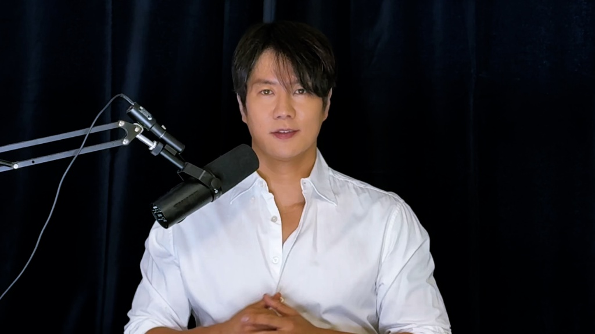
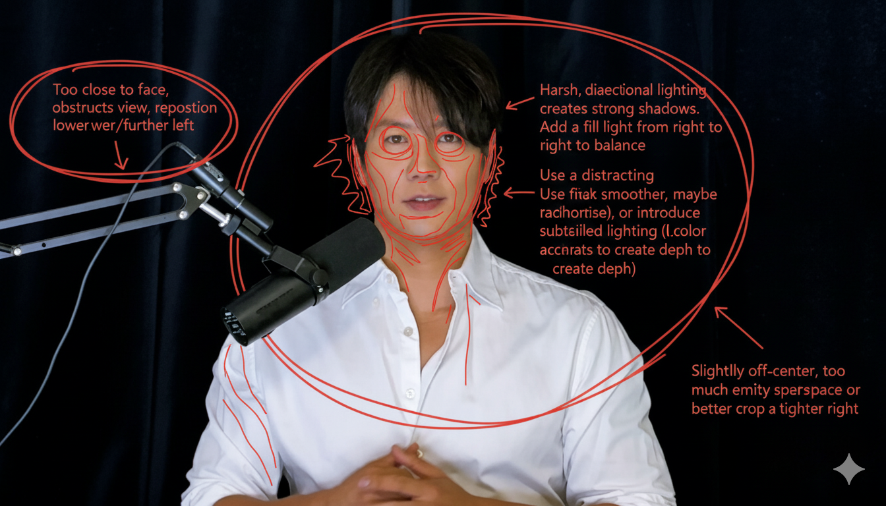

# 🍌 나노바나나 이미지 생성 마스터 클래스 커리큘럼

## 📋 전체 개요
- **총 영상 수**: 12개 (약 200분)
- **대상**: 초보자부터 전문가까지
- **목표**: 나노바나나를 활용한 다양한 이미지 생성 및 편집 기법 마스터
- **사용 케이스**: 실제 프로젝트의 case1~case68 예시 활용
- **특징**: 모든 예시는 실제 이미지 파일과 검증된 프롬프트 사용

### 📊 **사용된 실제 케이스 목록**
**기초편**: Case 7, 15, 20, 25, 29, 37, 63  
**스타일편**: Case 5, 11, 21, 22, 51, 52, 57  
**합성편**: Case 1, 4, 6, 8, 10, 26, 61, 64  
**시점편**: Case 2, 9, 23, 33, 58, 59, 62  
**전문편**: Case 14, 19, 32, 45, 46, 47, 48, 65  
**아트편**: Case 12, 24, 35, 39, 49, 50, 55

---

## 🎯 **LEVEL 1: 기초 입문편**

### **📺 영상 1: 나노바나나 시작하기** (15분)
**목표**: 나노바나나의 기본 개념과 첫 이미지 생성

**다룰 예시들:**

**🖼️ Case 20: 옛날 사진 채색 ⭐ 메인**

| 입력 | 결과물 |
|:---:|:---:|
|  |  |

**입력:** 복원이 필요한 옛날 사진 업로드

**프롬프트:**
```
이 사진을 복원하고 채색해줘.
```

**🖼️ Case 7: 자동 사진 편집**

| 입력 | 결과물 |
|:---:|:---:|
|  |  |

**입력:** 수정이 필요한 이미지 업로드

**프롬프트:**
```
이 사진은 너무 평범하고 지루해요. 좀 더 다채로워 보이게 바꿔주세요! 대비를 높이고, 색상을 강조하고, 조명을 밝게 해서 더욱 풍부하게 해주세요. 사진을 자르거나 구도를 바꾸는 디테일을 삭제해도 좋아요.
```

**🖼️ Case 63: 증명사진 만들기**

| 입력 | 결과물 |
|:---:|:---:|
|  |  |

**입력:** 인물 참고 이미지 업로드

**프롬프트:**
```
머리 부분을 크롭해서 2인치 증명사진으로 만들어줘:
  1. 파란색 배경
  2. 전문적인 비즈니스 복장
  3. 정면 얼굴
  4. 약간의 미소
```

**구성**:
1. 나노바나나 소개 (3분)
2. 인터페이스 둘러보기 (2분)
3. 실습: 흑백사진을 컬러로 만들기 (6분)
4. 간단한 사진 보정하기 (3분)
5. 정리 및 다음 예고 (1분)

---

### **📺 영상 2: 기본 편집의 마법** (15분)
**목표**: 단일 이미지 편집의 기본기

**다룰 예시들:**

**🖼️ Case 15: 헤어스타일 바꾸기 ⭐ 메인**

| 입력 | 결과물 |
|:---:|:---:|
|  |  |

**입력:** 헤어스타일을 바꿀 인물 사진 업로드

**프롬프트:**
```
3x3 그리드 형식으로 다양한 헤어스타일을 가진 이 사람의 아바타를 생성해줘
```

**🖼️ Case 25: 캐릭터 포즈 수정**

| 입력 | 결과물 |
|:---:|:---:|
|  |  |

**입력:** 참조 이미지 업로드

**프롬프트:**
```
사진에 있는 사람을 앞을 바라보게 수정해줘
```

**🖼️ Case 29: 빨간펜 피드백**

| 입력 | 결과물 |
|:---:|:---:|
|  |  |

**입력:** 참조 이미지 업로드

**프롬프트:**
```
이 이미지를 분석하고 빨간 펜으로 고쳐야 할 점을 써주세요.
```

**🖼️ Case 37: 화장 분석**

| 입력 | 결과물 |
|:---:|:---:|
|  |  |

**입력:** 캐릭터 참조 이미지 업로드

**프롬프트:**
```
이 이미지를 분석하고 빨간 펜으로 고칠 수 있는 부분을 마킹해줘.
이 이미지를 분석하고 빨간 펜으로 나아질 수 있는 부분을 표시해줘.
```

**구성**:
1. 인물 편집 기초 (3분)
2. 실습: 9가지 헤어스타일 생성 (6분)
3. 포즈와 표정 수정하기 (4분)
4. AI 피드백 활용법 (2분)

---

## 🎨 **LEVEL 2: 스타일 변환편**

### **📺 영상 3: 시간여행 스타일링** (18분)
**목표**: 다양한 시대와 스타일로 변환

**다룰 예시들:**

**🖼️ Case 5: 다양한 역사적 시대 스타일 ⭐ 메인**
- **입력**: `images/case5/input.jpg` - 현대 인물 사진
- **프롬프트**: `이 캐릭터의 스타일을 [1970년대]의 고전적인 [남성] 스타일로 변경해 주세요. [긴 곱슬머리] 머리와 [긴 콧수염]을 추가하고, 배경을 상징적인 [캘리포니아 여름 풍경]으로 변경하세요. 캐릭터의 얼굴은 변경하지 마세요.`
- **출력**: `images/case5/output.jpg` - 1970년대 스타일로 변환된 인물

**🖼️ Case 11: 애니에서 실제 코스러로**
- **입력**: `images/case11/input.jpg` - 애니메이션 캐릭터
- **프롬프트**: `이 일러스트레이션 사진에 있는 여자 아이를 코믹콘에 서있는 코스플레이어 사진으로 바꿔줘.`
- **출력**: `images/case11/output.jpg` - 실제 코스플레이어 사진

**🖼️ Case 57: 만화 스타일로 변환**
- **입력**: `images/case57/input.jpg` - 실제 사진
- **프롬프트**: `입력된 사진을 흑백 만화 스타일의 선 드로잉으로 바꿔줘.`
- **출력**: `images/case57/output.jpg` - 만화풍 선화

**🖼️ Case 51: 고대 지도 → 역사적인 풍경 사진**
- **입력**: `images/case51/input.jpg` - 고대 지도
- **프롬프트**: `풀컬러 사진. 1660년의 뉴암스테르담. 오늘 찍은 사진처럼 완전히 현대적인 색상으로 표현해줘.`
- **출력**: `images/case51/output.jpg` - 현실적인 역사 풍경

**구성**:
1. 시대별 스타일 특징 (3분)
2. 실습: 1970년대 스타일 변환 (8분)
3. 애니메이션 ↔ 실사 변환 (4분)
4. 시간대 비교 이미지 만들기 (3분)

---

### **📺 영상 4: 의상과 메이크업 마스터** (16분)
**목표**: 패션과 뷰티 편집 전문

**다룰 예시들:**

**🖼️ Case 21: OOTD 오늘의 코디 ⭐ 메인**
- **입력**: `images/case21/input.jpg` - 인물과 옷 이미지
- **프롬프트**: `사진 2에 있는 의상과 아이템을 사용해서 사진 1에 있는 사람에게 입혀줘. 자연광, 스트리트, 그리고 선명한 전신 샷으로 여러 OOTD 사진을 야외에서 찍어줘.`
- **출력**: `images/case21/output.jpg` - OOTD 스타일 사진

**🖼️ Case 22: 캐릭터 의상 변경**
- **입력**: `images/case22/input.jpg` - 인물과 옷
- **프롬프트**: `입력한 이미지에 있는 인물의 옷을 타겟 이미지에 표시된 옷으로 바꿔주세요. 인물의 포즈, 표정, 배경은 그대로 유지하고, 옷만 바꾸도록 하세요.`
- **출력**: `images/case22/output.jpg` - 의상이 변경된 인물

**🖼️ Case 52: 패션 무드보드 콜라주**
- **입력**: `images/case52/input.jpg` - 패션 사진
- **프롬프트**: `패션 무드보드 콜라주. 포트레이트 주변에 모델이 착용한 개별 아이템들의 컷아웃을 배치해줘. 장난스러운 마커 스타일 글씨체로 손글씨 메모와 스케치를 추가하고, 각 아이템의 브랜드명과 출처는 영어로 표기해줘.`
- **출력**: `images/case52/output.jpg` - 패션 무드보드

**구성**:
1. OOTD 사진 제작법 (7분)
2. 가상 메이크업 체험 (5분)
3. 패션 무드보드 만들기 (4분)

---

## 🧩 **LEVEL 3: 창의적 합성편**

### **📺 영상 5: 다중 이미지 마법사** (20분)
**목표**: 여러 이미지를 조합한 창작

**다룰 예시들:**

**🖼️ Case 6: 여러 이미지를 참고한 사진 생성 ⭐ 메인**
- **입력**: `images/case6/input.jpg` - 여러 참고 이미지
- **프롬프트**: `모델이 분홍색 BMW에 기대어 포즈를 취하고 있습니다. 그녀는 다음 소품들을 착용하고 있으며, 배경은 밝은 회색입니다. 녹색 외계인은 열쇠고리로 분홍색 핸드백에 연결되어 있습니다. 모델의 어깨에는 분홍색 앵무새가 있습니다.`
- **출력**: `images/case6/output.jpg` - 복합 시나리오 이미지

**🖼️ Case 8: 그림판 초안으로 여러 캐릭터 포즈 바꾸기**
- **입력**: `images/case8/input.jpg` - 캐릭터들과 스케치
- **프롬프트**: `세번째 사진의 포즈를 사용해서 두 캐릭터가 싸우게 해줘. 상황에 맞는 배경이랑 상호작용은 알아서 넣어줘. 생성될 이미지 비율은 16:9 이야.`
- **출력**: `images/case8/output.jpg` - 전투 장면

**🖼️ Case 26: 선 드로잉에서 사진으로**
- **입력**: `images/case26/input.jpg` - 선화와 참고 이미지
- **프롬프트**: `사진 1에 있는 사람의 포즈를 사진 2에 있는 포즈로 바꾸고, 전문 사진 스튜디오에서 촬영해줘`
- **출력**: `images/case26/output.jpg` - 스튜디오 사진

**🖼️ Case 10: 맞춤형 캐릭터 스티커**
- **입력**: `images/case10/input.jpg` - 캐릭터와 스티커 모티브
- **프롬프트**: `두번째 사진에 있는 캐릭터를 흰 윤곽선이 있는 스티커로 만들어줘. 캐릭터를 웹 일러스트 스타일로 바꾸고, 첫번째 사진에 있는 모티브를 설명하는 짧은 글귀를 아래에 적어줘.`
- **출력**: `images/case10/output.jpg` - 캐릭터 스티커

**구성**:
1. 다중 참조 이미지 활용법 (5분)
2. 실습: 복합 시나리오 생성 (8분)
3. 스케치를 실제 이미지로 (4분)
4. 캐릭터 스티커 제작 (3분)

---

### **📺 영상 6: 3D & 건축 변환 마스터** (18분)
**목표**: 2D를 3D로, 평면을 입체로

**다룰 예시들:**

**🖼️ Case 1: 일러스트레이션에서 피규어로 ⭐ 메인**
- **입력**: `images/case1/input0.jpg` - 캐릭터 일러스트
- **프롬프트**: `이 사진을 캐릭터 피규어로 바꿔줘. 뒤에는 캐릭터 이미지가 인쇄된 박스를 놓고, 컴퓨터 화면에는 블렌더 모델링 과정을 띄워줘. 박스 앞에는 둥근 플라스틱 베이스를 놓고 그위에 캐릭터 피규어를 세워주고, 가능하면 실내 배경으로 설정해줘.`
- **출력**: `images/case1/output0.jpg` - 3D 피규어 세트

**🖼️ Case 4: 3D 건물 추출/등축 투영 모델**
- **입력**: `images/case4/input.jpg` - 건물 사진
- **프롬프트**: `사진을 낮 시간으로 바꾸고, 그중 [건물]만 추출해서 등축 투영 모델로 바꿔줘`
- **출력**: `images/case4/output.jpg` - 등축투영 건물

**🖼️ Case 61: 평면도 3D 렌더링**
- **입력**: `images/case61/input.jpg` - 건축 평면도
- **프롬프트**: `이 주택 평면도를 입체적이고 사실적인 3D 렌더링으로 바꿔줘.`
- **출력**: `images/case61/output.jpg` - 3D 건축 렌더링

**🖼️ Case 64: 풍경을 A6 접이식 카드로**
- **입력**: `images/case64/input.jpg` - 풍경 사진
- **프롬프트**: `펼치면 3D의 작은 구체 하우스와 미니어처 종이 정원, 그리고 분재 나무가 나타나는 A6 접이식 카드를 그려줘.`
- **출력**: `images/case64/output.jpg` - 3D 팝업 카드

**구성**:
1. 2D→3D 변환 원리 (3분)
2. 실습: 캐릭터 피규어 제작 (8분)
3. 건축 도면 3D 렌더링 (4분)
4. 조각품과 아트워크 제작 (3분)

---

## 🌍 **LEVEL 4: 공간과 시점편**

### **📺 영상 7: 시점의 마술사** (16분)
**목표**: 다양한 관점과 시각 변환

**다룰 예시들:**

**🖼️ Case 2: 지도 위 화살표에서 본 지상 이미지 생성 ⭐ 메인**
- **입력**: `images/case2/input.jpg` - 구글맵 화살표
- **프롬프트**: `빨간색 화살표가 보고 있는걸 그려줘 / 빨간색 동그라미에서 화살표 방향으로 섰을 때 보이는 이미지를 만들어줘`
- **출력**: `images/case2/output.jpg` - 지상 시점 풍경

**🖼️ Case 9: 조감도 생성**
- **입력**: `images/case9/input.jpg` - 지상 사진
- **프롬프트**: `사진을 위에서 바라보는 형식으로 바꾸고 사진 작가의 위치를 표시해줘.`
- **출력**: `images/case9/output.jpg` - 조감도 시점

**🖼️ Case 23: 다각도 자료 생성**
- **입력**: `images/case23/input.jpg` - 단일 객체
- **프롬프트**: `흰 배경에 앞, 뒤, 왼쪽, 오른쪽 위, 아래 사진을 균일한 간격으로 생성해줘. 동일한 피사체로 등각투영과 원근법과 같이.`
- **출력**: `images/case23/output.jpg` - 6방향 다각도 뷰

**🖼️ Case 62: 카메라 세팅 리셋**
- **입력**: `images/case62/input.jpg` - 일반 사진
- **프롬프트**: `RAW-ISO [100] - [F2.8-1/200 24mm] settings`
- **출력**: `images/case62/output.jpg` - 카메라 설정 적용된 사진

**구성**:
1. 시점 변환의 이해 (3분)
2. 실습: 구글맵에서 실제 풍경으로 (7분)
3. 다각도 뷰 생성하기 (4분)
4. 카메라 설정 조절법 (2분)

---

### **📺 영상 8: 가상 세계 창조하기** (17분)
**목표**: 판타지와 게임 세계 구현

**다룰 예시들:**

**🖼️ Case 33: 지도에서 등축투영 건물로 ⭐ 메인**
- **입력**: `images/case33/input.jpg` - 지도
- **프롬프트**: `이 위치에 있는 랜드마크를 게임 놀이공원 스타일의 등축투영으로 (빌딩만) 만들어줘`
- **출력**: `images/case33/output.jpg` - 게임스타일 등축 건물

**🖼️ Case 59: 마인크래프트 스타일 풍경 생성**
- **입력**: `images/case59/input.jpg` - 구글맵 지역
- **프롬프트**: `이 위치에 있는 랜드마크를 사용해서, 입체 도면으로 HD-2D 마인크래프트 스타일의 이미지를 만들어줘.`
- **출력**: `images/case59/output.jpg` - 마인크래프트 풍경

**🖼️ Case 58: 입체 도면 스타일 홀로그래픽**
- **입력**: `images/case58/input.jpg` - 선화 도면
- **프롬프트**: `업로드 된 이미지에 있는 와이어프레임 선을 바탕으로 홀로그래픽 이미지를 만들어줘.`
- **출력**: `images/case58/output.jpg` - 홀로그래픽 와이어프레임

**구성**:
1. 게임 스타일 건축물 (5분)
2. 실습: 테마파크 스타일 변환 (7분)
3. 판타지 세계 만들기 (3분)
4. 홀로그래픽 효과 (2분)

---

## 🎬 **LEVEL 5: 전문 활용편**

### **📺 영상 9: 비즈니스 & 교육 활용** (22분)
**목표**: 실무에 바로 쓸 수 있는 전문 기능

**다룰 예시들:**

**🖼️ Case 14: 기사 포스터 ⭐ 메인**
- **입력**: `images/case14/input.jpg` - 기사 내용이나 아이디어
- **프롬프트**: `업로드 된 이미지를 1970년대 빈티지 포스터 스타일로 바꿔줘.`
- **출력**: `images/case14/output.jpg` - 빈티지 스타일 포스터

**🖼️ Case 48: 음식 칼로리 표기**
- **입력**: `images/case48/input.jpg` - 음식 사진
- **프롬프트**: `업로드 된 음식의 칼로리, 영양성분, 재료들을 분석해서 표시해줘.`
- **출력**: `images/case48/output.jpg` - 영양정보 라벨링

**🖼️ Case 47: 하드웨어 분해도**
- **입력**: `images/case47/input.jpg` - 전자제품
- **프롬프트**: `이 제품의 내부 구조와 부품들을 분해도 형태로 보여줘.`
- **출력**: `images/case47/output.jpg` - 기술 분해도

**🖼️ Case 19: 수학 문제 풀이**
- **입력**: `images/case19/input.jpg` - 수학 문제
- **프롬프트**: `이 수학 문제의 풀이 과정을 단계별로 시각화해서 보여줘.`
- **출력**: `images/case19/output.jpg` - 수학 풀이 과정

**구성**:
1. 인포그래픽 제작법 (6분)
2. 실습: 블로그 포스터 만들기 (8분)
3. 교육용 다이어그램 제작 (5분)
4. 전문 분야별 활용법 (3분)

---

### **📺 영상 10: 상업적 창작물 제작** (20분)
**목표**: 판매 가능한 수준의 창작물

**다룰 예시들:**

**🖼️ Case 45: 레고 미니 피규어 ⭐ 메인**
- **입력**: `images/case45/input.jpg` - 캐릭터나 인물
- **프롬프트**: `이 캐릭터를 레고 미니피규어 스타일로 만들어줘. 레고 브릭으로 만든 것처럼.`
- **출력**: `images/case45/output.jpg` - 레고 스타일 피규어

**🖼️ Case 46: 건담 모델 피규어**
- **입력**: `images/case46/input.jpg` - 로봇이나 캐릭터
- **프롬프트**: `이 캐릭터를 건담 플라모델 스타일로 변환해줘. 프라모델 박스와 함께.`
- **출력**: `images/case46/output.jpg` - 건담 플라모델

**🖼️ Case 32: 액션 피규어**
- **입력**: `images/case32/input.jpg` - 인물이나 캐릭터
- **프롬프트**: `사진에 있는 사람을 위트 있고 만화적인 스타일의 원형 아바타로 바꿔줘. 배경은 단색으로 해줘.`
- **출력**: `images/case32/output.jpg` - 액션 피규어 스타일

**🖼️ Case 65: 체스판 디자인**
- **입력**: `images/case65/input.jpg` - 테마나 아이디어
- **프롬프트**: `이 테마로 체스판과 체스 말들을 디자인해줘. 창의적이고 독특하게.`
- **출력**: `images/case65/output.jpg` - 테마 체스판

**구성**:
1. 상품 패키징 디자인 (5분)
2. 실습: 레고 스타일 피규어 제작 (8분)
3. 쥬얼리와 굿즈 디자인 (4분)
4. 게임 아이템 디자인 (3분)

---

## 🎭 **LEVEL 6: 아티스틱 마스터편**

### **📺 영상 11: 스토리텔링 & 시퀀스** (25분)  
**목표**: 연속된 이야기와 복합 작품

**다룰 예시들:**

**🖼️ Case 24: 영화 콘티 ⭐ 메인**
- **입력**: `images/case24/input.jpg` - 스토리 아이디어나 스크립트
- **프롬프트**: `이 스토리를 12컷 영화 콘티로 만들어줘. 각 컷마다 카메라 앵글과 상황을 다르게.`
- **출력**: `images/case24/output.jpg` - 12컷 스토리보드

**🖼️ Case 12: 캐릭터 디자인 생성**
- **입력**: `images/case12/input.jpg` - 캐릭터 아이디어
- **프롬프트**: `이 캐릭터의 다양한 표정과 포즈를 캐릭터 시트로 만들어줘.`
- **출력**: `images/case12/output.jpg` - 캐릭터 시트

**🖼️ Case 35: 일러스트레이션 그리는 과정을 4컷으로**
- **입력**: `images/case35/input.jpg` - 완성된 작품
- **프롬프트**: `이 일러스트를 그리는 과정을 4단계로 나눠서 보여줘. 스케치→선화→색칠→완성`
- **출력**: `images/case35/output.jpg` - 4단계 제작 과정

**구성**:
1. 스토리보드 기획법 (4분)
2. 실습: 12컷 영화 콘티 제작 (12분)
3. 캐릭터 시트 만들기 (5분)
4. 만화 제작 기법 (4분)

---

### **📺 영상 12: 실험적 아트 & 고급 기법** (21분)
**목표**: 예술적 표현과 실험적 기법

**다룰 예시들:**

**🖼️ Case 39: 타이포그래픽 일러스트레이션 ⭐ 메인**
- **입력**: `images/case39/input.jpg` - 텍스트나 단어
- **프롬프트**: `이 단어를 그 의미를 표현하는 타이포그래픽 아트로 만들어줘.`
- **출력**: `images/case39/output.jpg` - 타이포 아트

**🖼️ Case 49: 대상 추출과 투명 레이어 배치**
- **입력**: `images/case49/input.jpg` - 복합 이미지
- **프롬프트**: `이 이미지에서 주요 객체들을 추출해서 투명 배경으로 분리해줘.`
- **출력**: `images/case49/output.jpg` - 분리된 레이어들

**🖼️ Case 50: 이미지 경계 확장/고치기**
- **입력**: `images/case50/input.jpg` - 잘린 이미지
- **프롬프트**: `이 이미지의 경계를 자연스럽게 확장해서 더 넓은 화면으로 만들어줘.`
- **출력**: `images/case50/output.jpg` - 확장된 이미지

**🖼️ Case 55: 애니 랩핑카 만들기**
- **입력**: `images/case55/input.jpg` - 캐릭터와 자동차
- **프롬프트**: `이 캐릭터를 사용해서 자동차 랩핑 디자인을 만들어줘.`
- **출력**: `images/case55/output.jpg` - 애니 랩핑카

**구성**:
1. 타이포그래피 아트 (6분)
2. 실습: 글자로 그림 그리기 (8분)
3. 고급 편집 기법들 (4분)
4. 창의적 실험 방법론 (3분)

---

## 📈 **학습 경로 추천**

### 🟢 **초보자 경로** (총 45분)
1. 영상 1: 나노바나나 시작하기
2. 영상 2: 기본 편집의 마법
3. 영상 3: 시간여행 스타일링

### 🟡 **중급자 경로** (총 74분)  
1. 영상 4: 의상과 메이크업 마스터
2. 영상 5: 다중 이미지 마법사
3. 영상 6: 3D & 건축 변환 마스터
4. 영상 7: 시점의 마술사

### 🔴 **고급자 경로** (총 105분)
1. 영상 8: 가상 세계 창조하기
2. 영상 9: 비즈니스 & 교육 활용
3. 영상 10: 상업적 창작물 제작
4. 영상 11: 스토리텔링 & 시퀀스
5. 영상 12: 실험적 아트 & 고급 기법

---

## 💡 **제작 가이드라인**

### **🎬 영상 구성 템플릿**
1. **오프닝** (30초): 로고 + 이번 영상 주제
2. **학습 목표** (30초): 오늘 배울 내용 미리보기
3. **이론 설명** (2-4분): 기법의 원리와 활용
4. **메인 실습** (5-15분): 단계별 따라하기
5. **추가 예시** (2-5분): 다른 변형 방법들
6. **정리 & 과제** (1분): 요약 및 연습 과제
7. **다음 예고** (30초): 다음 영상 미리보기

### **📋 준비물 체크리스트**
- [ ] 나노바나나 계정
- [ ] 예시 이미지 파일들 (다운로드 링크 제공)
- [ ] 화면 녹화 소프트웨어
- [ ] 자막 편집 도구
- [ ] 템플릿 파일들

### **🎯 핵심 포인트**
1. **실습 중심**: 이론 30% + 실습 70%
2. **점진적 난이도**: 쉬운 것부터 복잡한 것까지
3. **실용성**: 바로 써먹을 수 있는 내용
4. **창의성**: 응용과 변형 방법 제시
5. **접근성**: 초보자도 쉽게 따라할 수 있게

---

## 🎁 **보너스 컨텐츠 아이디어**

### **특별편들**
- **Q&A 라이브**: 시청자 질문 답변
- **챌린지편**: 30초 만에 이미지 만들기
- **실패작 분석편**: 잘못된 프롬프트 사례
- **트렌드 특집**: 최신 밈과 트렌드 활용
- **콜라보편**: 다른 크리에이터와 협업

### **추가 자료**
- **프롬프트 템플릿 모음집**
- **트러블슈팅 가이드**
- **커뮤니티 갤러리**
- **월간 베스트 작품 모음**

이 커리큘럼으로 체계적이고 재미있는 나노바나나 마스터 클래스를 만들어보세요! 🚀
