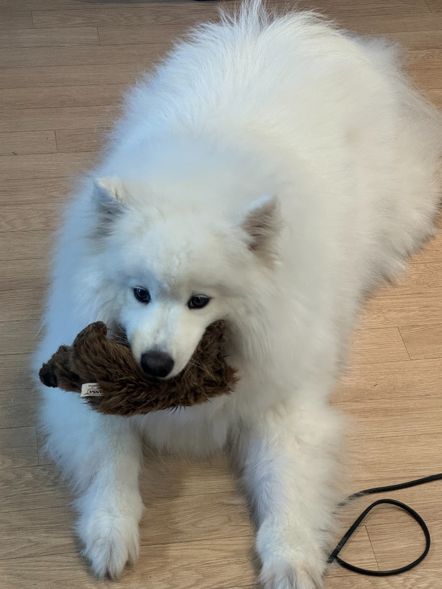
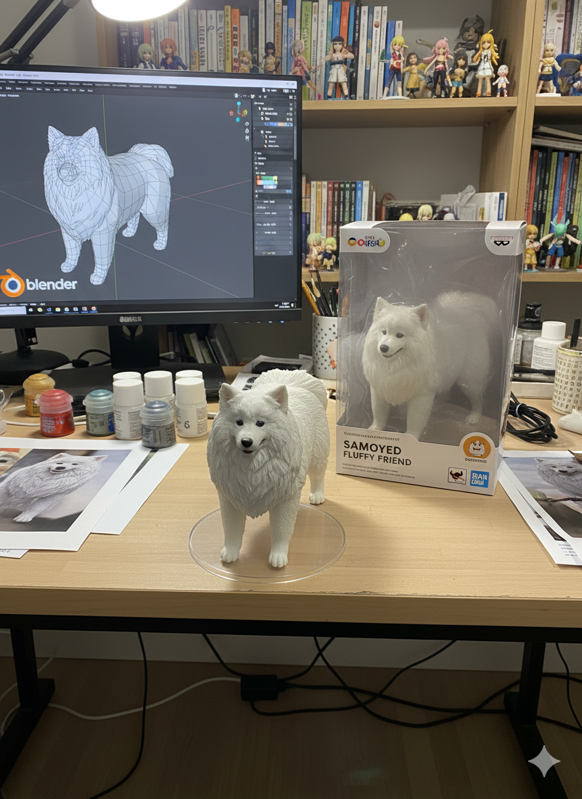
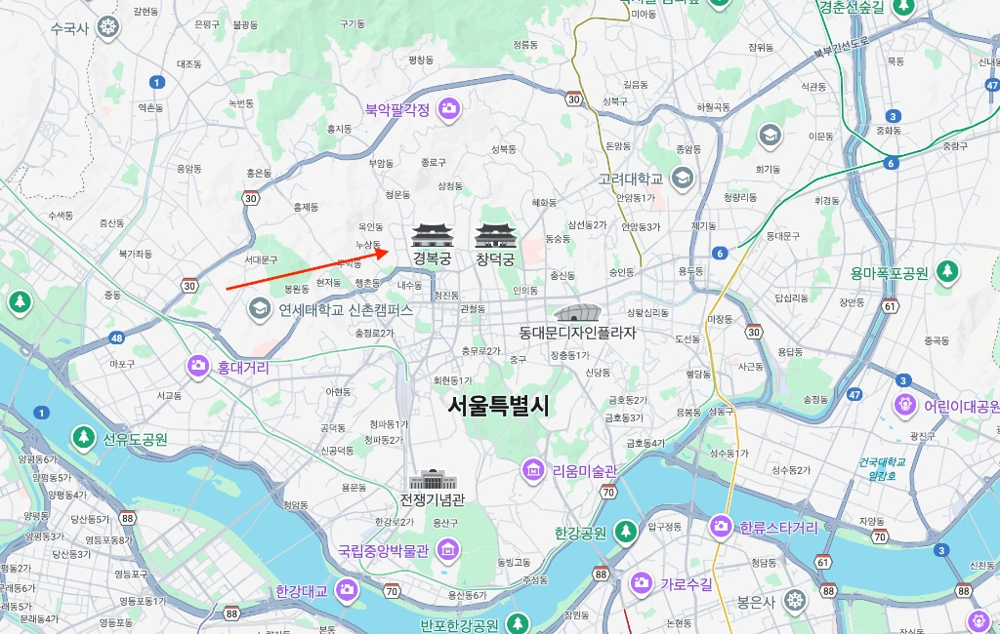
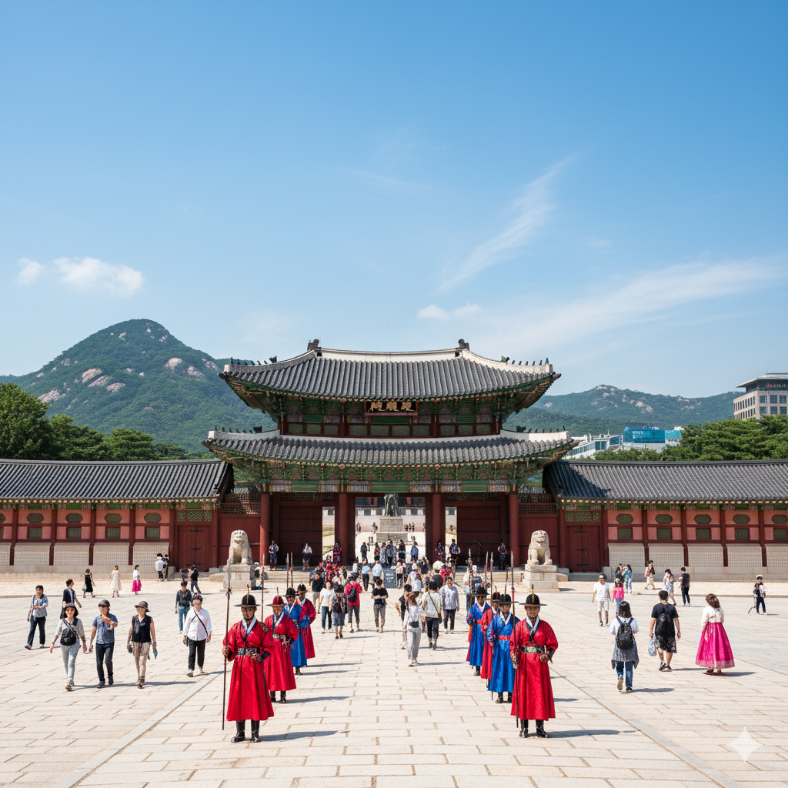

# 🔥 나노바나나로 만드는 놀라운 7가지 마법

## 📋 특별편 개요
- **영상 길이**: 25분
- **대상**: 나노바나나가 처음인 모든 사람들
- **목표**: 가장 재미있고 임팩트 있는 케이스들로 나노바나나의 무한한 가능성 체험

---

## 🎪 놀라운 변신 7연발!

### **🖼️ Case 1: 일러스트에서 실제 피규어로! 🔥**

| 입력 | 결과물 |
|:---:|:---:|
|  |  |

**입력:** 캐릭터 일러스트 업로드

**프롬프트:**
```
이 사진을 캐릭터 피규어로 바꿔줘. 뒤에는 캐릭터 이미지가 인쇄된 박스를 놓고, 컴퓨터 화면에는 블렌더 모델링 과정을 띄워줘. 박스 앞에는 둥근 플라스틱 베이스를 놓고 그위에 캐릭터 피규어를 세워주고, 가능하면 실내 배경으로 설정해줘.
```

---

### **🖼️ Case 2: 구글맵에서 실제 풍경으로! 🌍**

| 입력 | 결과물 |
|:---:|:---:|
|  |  |

**입력:** 구글맵 화살표 업로드

**프롬프트:**
```
빨간색 화살표가 보고 있는걸 그려줘 / 빨간색 동그라미에서 화살표 방향으로 섰을 때 보이는 이미지를 만들어줘
```

---

### **🖼️ Case 6: 여러 이미지를 참고한 사진 생성! 🎨**

| 입력 | 결과물 |
|:---:|:---:|
|  |  |

**입력:** 여러 참고 이미지 업로드

**프롬프트:**
```
모델이 분홍색 BMW에 기대어 포즈를 취하고 있습니다. 그녀는 다음 소품들을 착용하고 있으며, 배경은 밝은 회색입니다. 녹색 외계인은 열쇠고리로 분홍색 핸드백에 연결되어 있습니다. 모델의 어깨에는 분홍색 앵무새가 있습니다. 그녀 옆에는 분홍색 목줄과 금색 헤드폰을 착용한 퍼그가 앉아 있습니다.
```

---

### **🖼️ Case 8: 그림판 초안으로 캐릭터 포즈 바꾸기! ⚔️**

| 입력 | 결과물 |
|:---:|:---:|
|  |  |

**입력:** 캐릭터 이미지와 손으로 그린 스케치를 업로드

**프롬프트:**
```
세번째 사진의 포즈를 사용해서 두 캐릭터가 싸우게 해줘. 상황에 맞는 배경이랑 상호작용은 알아서 넣어줘. 생성될 이미지 비율은 16:9 이야.
```

---


### **🖼️ Case 37: 화장 분석! 💄**

| 입력 | 결과물 |
|:---:|:---:|
|  |  |

**입력:** 캐릭터 참조 이미지 업로드

**프롬프트:**
```
이 이미지를 분석하고 빨간 펜으로 고칠 수 있는 부분을 마킹해줘.
이 이미지를 분석하고 빨간 펜으로 나아질 수 있는 부분을 표시해줘.
```

---

### **🖼️ Case 52: 패션 무드보드 콜라주! 🎀**

| 입력 | 결과물 |
|:---:|:---:|
|  |  |

**입력:** 참조 사진 업로드

**프롬프트:**
```
패션 무드보드 콜라주. 포트레이트 주변에 모델이 착용한 개별 아이템들의 컷아웃을 배치해줘. 장난스러운 마커 스타일 글씨체로 손글씨 메모와 스케치를 추가하고, 각 아이템의 브랜드명과 출처는 영어로 표기해줘. 전체적인 분위기는 창의적이고 귀엽게 만들어줘.
```

---

## 🎬 영상 구성

1. **오프닝: 나노바나나란?** (2분)
   - 나노바나나 소개 및 AI 이미지 생성의 혁신
   - 이 영상에서 보게 될 7가지 마법 미리보기

2. **케이스 1-4: 창의적 변환의 마법** (14분)
   - Case 1: 일러스트 → 피규어 (3.5분)
   - Case 2: 지도 → 풍경 (3.5분)
   - Case 6: 여러 참고 → 합성 사진 (3.5분)
   - Case 8: 스케치 → 액션 장면 (3.5분)

3. **케이스 5-7: 전문적 편집의 마법** (8분)
   - Case 37: AI 화장 분석 (4분)
   - Case 52: 패션 무드보드 (4분)

4. **마무리: 무한한 가능성** (1분)
   - 나노바나나의 잠재력과 정규 커리큘럼 소개
   - 구독 및 다음 영상 예고

---

## 💡 특별편의 특징

> [!tip] **왜 이 7가지인가?**
> 
> **🎯 최고 임팩트**: 결과가 놀랍고 시각적으로 강력한 케이스들
> 
> **🌈 다양성**: 
> - **창의적 변환**: 일러스트→피규어, 지도→풍경, 스케치→액션
> - **전문적 편집**: AI 화장 분석, 패션 무드보드 제작
> - **복합 작업**: 여러 참고 이미지 합성, 캐릭터 포즈 변경
> - **실무 활용**: 창작 지원, 전문 분석, 스타일 변환
> 
> **👥 대중성**: 누구나 흥미로워할만한 친숙한 주제들
> 
> **🔥 바이럴성**: SNS에서 화제가 될만한 "이게 가능해?" 급 케이스들

---

## 🎪 활용 팁

### **📱 SNS 활용**
- 각 케이스별로 Before/After 비교 이미지 제작
- 인스타그램 릴스로 개별 케이스 소개
- 유튜브 쇼츠로 하이라이트 클립 제작

### **🎓 교육 활용**
- 나노바나나 입문자를 위한 첫 번째 영상
- AI 이미지 생성의 가능성을 보여주는 데모 영상
- 창작자들에게 영감을 주는 아이디어 소스

### **💼 비즈니스 활용**
- 클라이언트에게 나노바나나 역량 소개
- 마케팅 자료로 활용
- 워크샵 오프닝 영상으로 사용

---

## 📌 다음 단계

이 특별편을 본 후에는:

> [!tip] **🎓 체계적으로 배우고 싶다면?**
> 
> **[📚 나노바나나 정규 커리큘럼](나노바나나_정규_커리큘럼.md)**에서
> 12개 영상으로 구성된 완전한 마스터 클래스를 만나보세요!
> 
> - **LEVEL 1-6**: 기초부터 전문가까지 단계별 학습
> - **45개 실제 케이스**: 모든 상황에 대응
> - **200분 완전 코스**: 나노바나나 완전 정복

1. **[📚 정규 커리큘럼](나노바나나_정규_커리큘럼.md)**: 체계적인 학습
2. **🛠️ 실습**: 직접 따라해보기  
3. **👥 커뮤니티**: 결과물 공유 및 피드백
